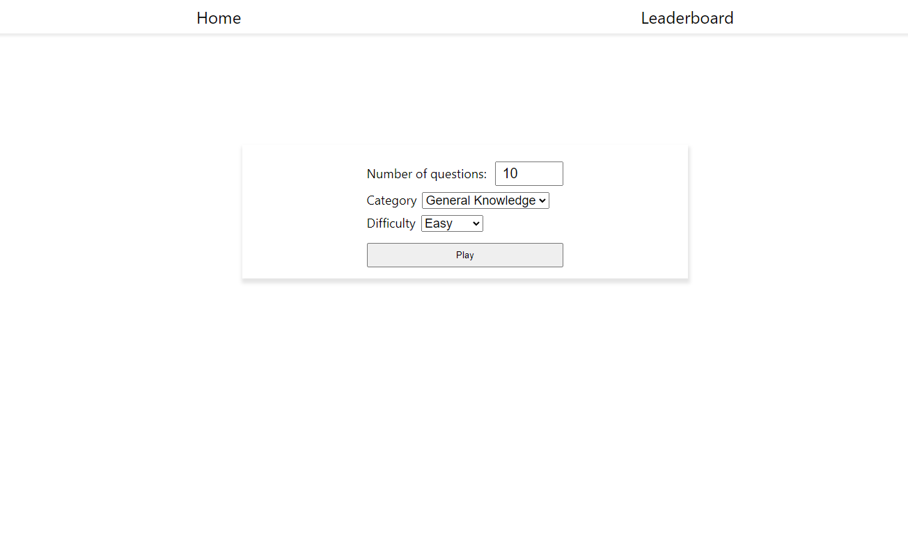
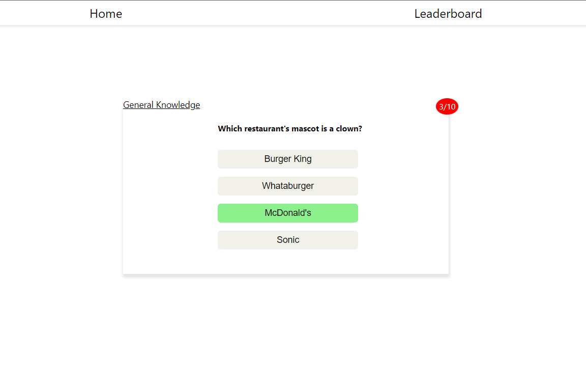

# React Quiz App

One of my first React Apps, kept the CSS to a minimum and really wanted to focus on functionallity.

I worked extensively with useContext and got really accustomed to it. I used React Router to get a better feel on how it works.

I used a custom useContext hook and learned a few more thinks about useContext.

Also had to figure out why it would zoom into the options on click while on mobile.

If you want you can try out the website and test your knowledge: [Quiz App Website](https://zweitomf.netlify.app/)

